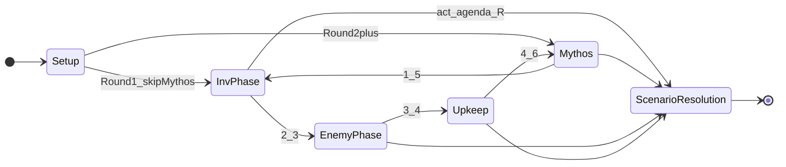

# Framework Step 完整索引

> **用途**：验收「任意 Grimoire Framework Event 可映射到唯一 `FrameworkStep` ID」  
> **规则来源**：Grimoire III (pp.27–29), IV Skill Test (p.30), VI Setup (p.31)  
> **版本**：v0.2 · 2026-05-25

本表是 [02-framework-flow.md](02-framework-flow.md) 的快速对照索引。

---

## Setup Phase（Grimoire VI）

| Grimoire Step | FrameworkStep ID | Player Window |
|---|---|---|
| 1. Choose investigators | `SETUP_01_CHOOSE_INVESTIGATORS` | 无 |
| 2. Take trauma | `SETUP_02_APPLY_TRAUMA` | 无 |
| 3. Choose lead investigator | `SETUP_03_CHOOSE_LEAD_INVESTIGATOR` | 无 |
| 4. Shuffle investigator decks | `SETUP_04_SHUFFLE_INVESTIGATOR_DECKS` | 无 |
| 5. Assemble token pool | `SETUP_05_ASSEMBLE_TOKEN_POOL` | 无 |
| 6. Assemble chaos bag | `SETUP_06_ASSEMBLE_CHAOS_BAG` | 无 |
| 7. Starting resources (5) | `SETUP_07_STARTING_RESOURCES` | 无 |
| 8. Opening hands + mulligan | `SETUP_08_OPENING_HANDS_MULLIGAN` | 无 |
| 9. Read scenario intro | `SETUP_09_READ_SCENARIO_INTRO` | 无（可回溯 8） |
| 10. Scenario setup | `SETUP_10_SCENARIO_SETUP` | 无 |
| 11. Set agenda deck | `SETUP_11_SET_AGENDA_DECK` | 无 |
| 12. Set act deck | `SETUP_12_SET_ACT_DECK` | 无 |
| 13. Place scenario reference | `SETUP_13_PLACE_SCENARIO_REFERENCE` | 无 |
| 14. When the game begins | `SETUP_14_GAME_BEGINS_ABOUT` | 无 |

---

## Round Loop

**Round 1 例外**：跳过 Mythos，从 `INV_2_1_PHASE_BEGINS` 开始。

### I. Mythos Phase

| Grimoire | FrameworkStep ID | Player Window |
|---|---|---|
| 1.1 Mythos phase begins / Round begins | `MYTHOS_1_1_PHASE_BEGINS` | `PW_MYTHOS_AFTER_BEGIN` |
| 1.2 Place 1 doom on agenda | `MYTHOS_1_2_PLACE_DOOM` | — |
| 1.3 Check doom threshold | `MYTHOS_1_3_CHECK_DOOM_THRESHOLD` | — |
| 1.4 Each investigator draws encounter | `MYTHOS_1_4_DRAW_ENCOUNTER_EACH` | `PW_MYTHOS_AFTER_ENCOUNTER_DRAW`（每位后） |
| 1.5 Mythos phase ends | `MYTHOS_1_5_PHASE_ENDS` | `PW_MYTHOS_BEFORE_END` |

### II. Investigation Phase

| Grimoire | FrameworkStep ID | Player Window |
|---|---|---|
| 2.1 Investigation phase begins | `INV_2_1_PHASE_BEGINS` | `PW_INV_AFTER_PHASE_BEGIN` |
| 2.2 Next investigator turn begins | `INV_2_2_TURN_BEGINS` | — |
| 2.2.1 Take action | `INV_2_2_1_TAKE_ACTION` | `PW_INV_BEFORE_ACTION` → 行动 → `PW_INV_AFTER_ACTION` |
| 2.2.2 Turn ends | `INV_2_2_2_TURN_ENDS` | `PW_INV_BEFORE_TURN_END` |
| 2.3 Investigation phase ends | `INV_2_3_PHASE_ENDS` | — |

### III. Enemy Phase

| Grimoire | FrameworkStep ID | Player Window |
|---|---|---|
| 3.1 Enemy phase begins | `ENEMY_3_1_PHASE_BEGINS` | — |
| 3.2 Hunter/Patrol move | `ENEMY_3_2_HUNTER_PATROL_MOVE` | `PW_ENEMY_AFTER_MOVE` |
| 3.3 Engaged attacks | `ENEMY_3_3_ENGAGED_ATTACKS` | `PW_ENEMY_BETWEEN_ATTACKS` |
| 3.4 Enemy phase ends | `ENEMY_3_4_PHASE_ENDS` | — |

### IV. Upkeep Phase

| Grimoire | FrameworkStep ID | Player Window |
|---|---|---|
| 4.1 Upkeep phase begins | `UPKEEP_4_1_PHASE_BEGINS` | — |
| 4.2 Flip mini-cards | `UPKEEP_4_2_FLIP_MINI_CARDS` | — |
| 4.3 Ready exhausted | `UPKEEP_4_3_READY_EXHAUSTED` | `PW_UPKEEP_AFTER_READY` |
| 4.4 Draw 1 + gain 1 resource | `UPKEEP_4_4_DRAW_AND_RESOURCE` | — |
| 4.5 Check hand size (8) | `UPKEEP_4_5_CHECK_HAND_SIZE` | — |
| 4.6 Upkeep/Round ends | `UPKEEP_4_6_PHASE_ENDS` | — |

---

## Skill Test Timing（Grimoire IV）

嵌套于 Action / Encounter / Ability 内；**独立 `SkillTestStep` 枚举**，由 `SkillTestEngine` 独占，**不**注册为 `FrameworkStep` 子项（已裁决 OQ-IDX-01）。

| Grimoire ST | `SkillTestStep` ID | Player Window |
|---|---|---|
| ST.1 Determine skill / test begins | `ST_1_BEGIN` | — |
| ST.2 Commit cards | `ST_2_COMMIT` | `PW_SKILL_TEST_AFTER_COMMIT` |
| ST.3 Reveal chaos token | `ST_3_REVEAL` | — |
| ST.4 Apply symbol effect(s) | `ST_4_SYMBOL` | `PW_SKILL_TEST_AFTER_REVEAL`（ST.3–ST.4 整链结束后；递归 reveal another 中无 Window） |
| ST.5 Modified skill value | `ST_5_CALCULATE` | — |
| ST.6 Success/failure | `ST_6_RESOLVE_RESULT` | — |
| ST.7 Apply test results | `ST_7_APPLY` | — |
| ST.8 Test ends | `ST_8_END` | — |

---

## Initiation Sequence（Grimoire V）

非 Framework Step；由 `AbilityInitiationPipeline` 管理。**各步写入 EventRecord，与 Framework 同级**（已裁决 OQ-IDX-02）。

| Step | Pipeline ID |
|---|---|
| Pre: Play restrictions | `INIT_PRE_RESTRICTIONS` |
| Pre: Cost feasibility | `INIT_PRE_COST_CHECK` |
| 1. Apply cost modifiers | `INIT_1_APPLY_MODIFIERS` |
| 2. Pay costs | `INIT_2_PAY_COSTS` |
| 2b. Attacks of opportunity | `INIT_2B_AOO` |
| 3. Commence play/ability | `INIT_3_COMMENCE` |
| 4. Resolve effects | `INIT_4_RESOLVE` |

---

## Terminal States

| 条件 | FrameworkStep ID |
|---|---|
| `(→R#)` 达成 | `SCENARIO_RESOLUTION` |
| 无调查员存活 | `SCENARIO_RESOLUTION` (NO_RESOLUTION) |
| 游戏终止 | `GAME_OVER` |

---

## 状态转移简图

---

## Open Questions（本索引）

| ID | 优先级 | 问题 |
|---|---|---|
| OQ-IDX-03 | P2 | Encounter draw 1.4 内 surge 递归是否单独子步骤 ID？ |

### 已裁决

| ID | 裁决 | 日期 |
|---|---|---|
| OQ-IDX-01 | **独立 `SkillTestStep` 枚举**，`SkillTestEngine` 独占；不并入 `FrameworkStep`。见 Skill Test 表。 | 2026-05-25 |
| OQ-IDX-02 | Initiation 各步 **完整写入 EventRecord**，与 Framework **同级**可回放。 | 2026-05-25 |
