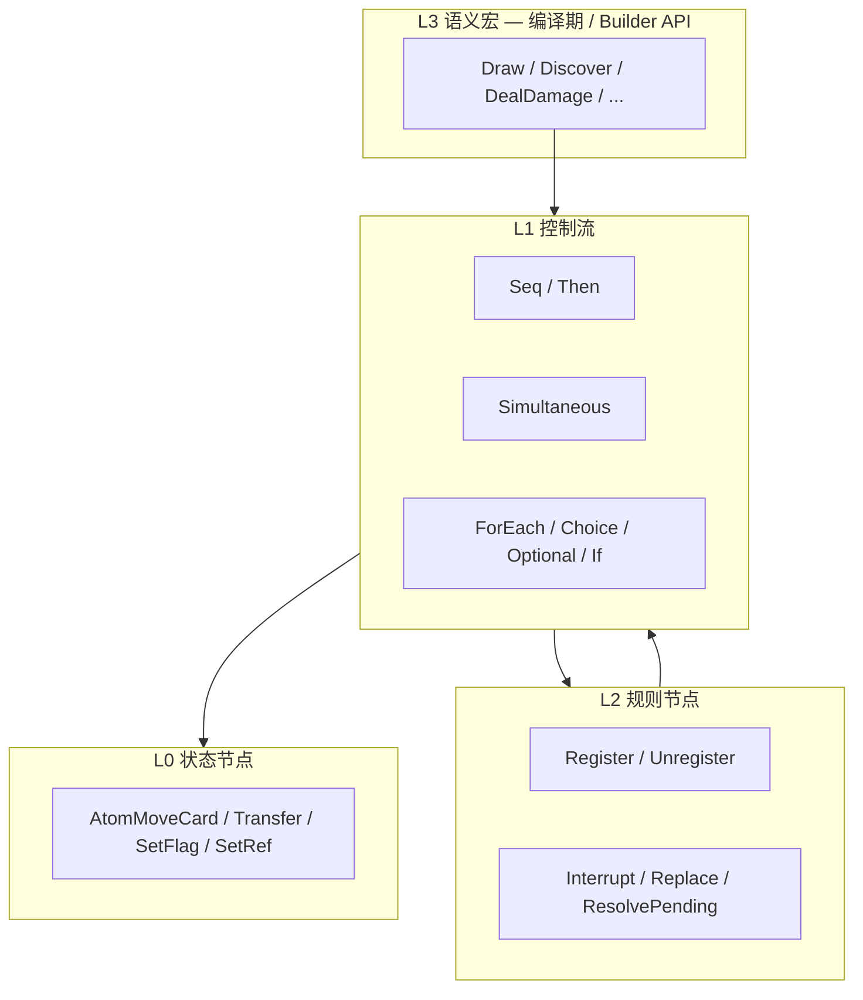

# 07b — 效果组合 Composition 规格

> **依赖**：[07-effect-primitives.md](07-effect-primitives.md), [06-registration-buff-model.md](06-registration-buff-model.md)  
> **被依赖**：[06-ability-initiation.md](06-ability-initiation.md)（dry-run）、LISTENER Buff  
> **状态**：v0.3 · 2026-06-18

---

## 1. 目标

定义 **效果组合（Composition）**：可执行的组合树，连接卡面文本、Initiation resolve 与 **效果**（**状态原语** L0 Atom + **Register**）。

**英文（代码）**：`Composition` / `CompositionNode` / `CompositionExecutor` / `CompositionDryRunner`  
**中文（文档）**：效果组合 / 组合节点

**揭示（Reveal）卡牌** 经 L0 **`AtomRevealCard`** 写入 Domain，**参与** §4 dry-run **CREATED** — 见 [07-effect-primitives §5.3](07-effect-primitives.md)、[01 §3.6](01-game-state-zones.md)。

---

## 2. 游戏结算的两类「直接影响」（= 效果）

几乎 **全部卡面效果 resolve** 对局面/规则的 **可 CREATED 写入** 只做两件事之一：

| 类型 | 改什么 | 组合节点 | 是否效果 |
|---|---|---|---|
| **状态变更** | `GameStateStore` | L0 **Atom**（**状态原语** 三类；含 **Reveal**） | **是** |
| **规则变更** | `RegistrationStore`（Buff） | L2 **Register** / **Unregister** | **是** |

Grimoire **Reveal 卡牌** = L0 **`reveal_to_*`**（③ 揭示状态），**不是** Register 之外的第三类机制；命名流程 D2/E2 的 reveal 步 **是效果施加**。

Cancel / Replacement、Draw、DealDamage 等 **不是** 第四类 CREATED 机制：前者是 L2 组合节点；后者是 **命名流程 / L3 宏** 展开。

---

## 3. 组合节点分层



### 3.1 Runtime 节点 kind（v1）

| 层 | kind | 说明 |
|---|---|---|
| L0 | `Atom` | [07-effect-primitives §5](07-effect-primitives.md) **三类状态原语** |
| L2 | `Register` | 插入 `Registration` |
| L2 | `Unregister` | 移除 Registration |
| L2 | `Interrupt` | 统一 Cancel / Ignore（nest `seq.interrupt.*` 或 `CompositionNode.interrupt_*`） |
| L2 | `Replace` | 统一 Instead（nest `seq.replace.instead` 或 `CompositionNode.replace_instead`） |
| L2 | `ResolvePending` | 窗口结束后 resolve pending |
| L1 | `Seq` | 顺序；Grimoire **Then** = 标记的 Seq |
| L1 | `Simultaneous` | 同时组；组 commit 后才 flush after |
| L1 | `ForEach` | 枚举目标 |
| L1 | `Choice` / `Optional` | 玩家选择 — **`PlayerInteractionGate`**（[16](16-player-interaction.md)） |
| L1 | `If` | 情景条件分支 · `CompositionNodeKind.IF`（§3.3） |

**L3 宏不进入 serialized tree**；`CompositionBuilder` 在编译期或调用时展开。

### 3.2 RegisterNode

```gdscript
class RegisterNode extends CompositionNode:
    var template: RegistrationTemplate   # lifetime + scope + buffs[]
```

创建 **持续 / 延时 / 进场能力** 均为此节点；差别在 `LifetimeSpec`（见 [06-registration-buff-model §6](06-registration-buff-model.md)）。

### 3.3 卡面 **If** 消歧（timing · condition · both · 已裁决 2026-07-07）

英文 **If** 在卡面上有歧义：可能是 **时点**、**情景条件（L3）**，或 **二者兼有**。编译管线 **必须** 标注 `if_kind`，**禁止** 把 Revelation/Forced 已提供的 timing 再译成 LISTENER。

| `if_kind` | 含义 | 引擎落点 | 典型例子 |
|---|---|---|---|
| **`timing`** | 何时能/必须触发 | TimingCatalog · L0 订阅 · COLLECT | Forced – **When** you draw…；If **during this test**…（无现态谓词） |
| **`condition`** | resolve **当下** 局面是否满足 | Composition **`IF`** + `Condition.matches_domain` | **12126** *If you have no clues*（Revelation 已定 G3 timing） |
| **`both`** | 窗口内再判现态 | timing 窗口 + L3 predicate | *If you reveal a `[skull]` during this test* |

**Revelation / Forced 前缀已给出 timing entry** 时，正文 leading **If** 默认按 **condition** 解析，除非命中 timing 短语（`during this test`、`when you draw` 等）。`Otherwise` = **互斥效果支**，译 `CompositionNode.if_else(then, else)`，**不是**新 timing。

#### 12126 Forbidden Secrets（锚例）

```text
<b>Revelation</b> – If you have no clues, … gains surge. Otherwise, test [intellect] (3)…

timing  : ENCOUNTER_CARD_DRAWN → G3（Revelation Forced，非 If 提供）
if_kind : condition
compile :
  if_else(
    Condition.investigator_has_no_clues(controller),
    then: grant_surge,
    else: intellect_test(3)   # partial · stub
  )
```

Python：`tools/arkhamdb_abilities.py` · `classify_if_kind()` + `compile_revelation_if_else()` → JSON `template: if_else`。

GDScript：`CompositionNodeKind.IF` · `Condition.from_compile_id()` · `ArkhamDbAbilityCompiler._build_if_else()`。

**Dry-run**：`IF` 在 fork 上 **求值 condition**，只 simulate **选中支**（与 `Choice` 的 OR 任一支不同）。

#### 「你的线索」（clues · 已裁决 2026-07-07）

一般情况下 **your clues / clues you have** = 调查员**卡牌上**的 clue 指示物（Domain · `investigator.clues_on_card` / `CLUES_ON_INVESTIGATOR`），**不**含地点上的 clue pool，除非卡面 explicitly 指 location。`Condition.investigator_has_no_clues` 即 `clues_on_card == 0`。

#### If 求值时机：`at_entry` vs `after_step`

| 模式 | 含义 | 锚卡 |
|---|---|---|
| **`at_entry`** | G3 显现 resolve **开头**判条件 | 12126 *If you have no clues* |
| **`after_step`** | **上一效果步完成后**再判（含「本效果是否 CREATED」） | 12160 *If no doom was placed by this effect* |

12160：**未执行** = 无合法目标 **或** 被 Cannot/Replacement 等拦截导致 place-doom 步 **未 CREATED** → 视为 no doom placed → gains surge。编译：`Seq(place_doom_nearest_enemy_without_doom → if_else(previous_step_not_created, grant_surge))`；等距 tie-break 由 **当前交互玩家**（drawer）`PICK_TARGET`。

#### 能力多要素拆分（已裁决 2026-07-07）

卡面能力可同时具备 **时点 · 条件 · 费用 · 效果**；编译 **能拆就拆**，勿合并为单一「If」或单一 template：

```text
Forced – When [timing], if [condition], [cost]: [effect]
  → LISTENER timing（When）
  → Condition L3（if）
  → CostPipeline L6（cost）
  → Composition（effect）
```

Revelation 无 When 前缀时，timing 由 **Revelation @ G3** 提供；正文 If 默认 **condition**（§3.3 表）。

#### 「Must choose」与 Choice dry-run（已裁决 2026-07-07 · FAQ）

卡面 **You must either (choose one)** / **must choose**（12124）或等效 **must** 语义（12126 fail-by 支：印刷漏写 must，按 must 解读）：

1. **resolve 前**用 dry-run **过滤选项**：仅保留 **至少能 CREATED 一项效果** 的分支。
2. 玩家 **必须** 选一项可执行选项；若仅一支可 CREATED → **自动**该支（headless 默认策略）。
3. Choice 合法性 dry-run（发起前）：仍 **OR 任一支 CREATED** 即可；**resolve 时**不得选 FIZZLE 支。

详 [16 §7.2.1](16-player-interaction.md#721-must-choose--可执行选项--已裁决)。

#### 12124 Cosmic Evils · 编译锚（partial）

```text
Choice(must, filter=dry_run_executable):
  A: place_doom(current_agenda) → nest 密谋推进框架（放置后 doom 阈值检测 · 可 advance）
  B: direct_damage(1) + direct_horror(1) + grant_surge
```

#### 12126 fail-by · must 语义

*For each point you fail by, you must either place 1 clue… or take 1 horror* — 印刷未写 must 视为 **笔误**；引擎按 **must choose 可执行项** 处理（无 clue 可放 → 必须 horror）。

#### 12160 Raising Suspicions · 编译锚（partial）

```text
timing  : Revelation @ G3
compile :
  Seq(
    place_doom_nearest_enemy_without_doom(drawer),
    if_else(previous_step_not_created, grant_surge)   # evaluate: after_step
  )
referent: CompositionExecutor.last_step_created + EventRecord COMPOSITION_STEP（07 §5）；非 Domain doom
tie     : nearest 等距 → 当前交互玩家 PICK_TARGET
```

## 4. 合法性 Dry-run（CompositionDryRunner）

> 完整 Initiation 流程见 [06 §7.2](06-ability-initiation.md)。Eligibility L7 终端 dry_run；COLLECT 不批量 dry_run。

### 4.1 原则（已裁决）

**有效性检测只关注「效果是否被创建」这一直接影响。**

- **Register**：`RegistrationStore` 中 **成功插入一条 Registration** → 该节点 **CREATED**（**Buff 写入是效果**）
- **Atom**（含 **`reveal_to_*`**、SetFlag/SetRef）：`StateMutator` 在 fork 上 **执行成功** → **CREATED**（**状态原语**）
- **Interrupt / Replace / ResolvePending**：pending 存在且操作成功 → **CREATED**

**Presentation** 只 **读** Domain 揭示状态渲染 UI；**不** 单独维护「谁看到了什么」。

**创建之后** Buff 是否退化、Listener 将来能否触发、MODIFIER 是否用到、牌堆是否会在未来变空 — **一律不查**。

### 4.2 发起合法条件

```text
initiation 合法  ⟺  play restrictions 过
                AND  cost 可付
                AND  simulate(composition).has_any_created == true
```

```gdscript
enum DryRunOutcome { CREATED, FIZZLE }

class CompositionDryRunner:
    func simulate(node: CompositionNode, sim: GameSimulator) -> DryRunResult:
        match node.kind:
            Atom:
                return CREATED if sim.apply_atom(node) else FIZZLE
            Register:
                return CREATED if sim.register(node.template) else FIZZLE
            Seq:
                var any := false
                for c in node.children:
                    any = any or simulate(c, sim).has_any_created
                return DryRunResult.new(has_any_created = any)
            Choice:
                return DryRunResult.new(
                    has_any_created = any(simulate(opt, sim).has_any_created for opt in node.options)
                )
            ...
```

### 4.3 Fork 范围

`GameSimulator.fork()` 必须包含：

- `GameStateStore`
- **`RegistrationStore`**
- （若测 Cancel）`PendingResolution` 队列

### 4.4 Dry-run vs 真实结算

| | 合法性 dry-run | 真实 resolve |
|---|---|---|
| **Seq / Then** | 子节点 **OR**：任一段 CREATED 即可发起 | **顺序**执行；Then 前段须 resolve 才进后段（Grimoire Then） |
| **Register** | 插入即 CREATED | 同左 |
| **Choice** | 任可选分支 CREATED | 玩家选一支执行 |
| **If** | 按 fork 上 condition 选一支 CREATED | 求值 condition 后执行 then/else |

### 4.5 示例

| 卡面 | dry-run |
|---|---|
| Until end of your turn, after you fight, draw 1 | **Register CREATED** → 合法（即使本回合不 fight） |
| Draw 1（仅一段，牌堆空） | Atom FIZZLE → 非法 |
| Draw 1 + Register（上例） | Register CREATED → **合法** |
| Heal 2（无受伤目标，且无 Register） | Atom FIZZLE → 非法 |

---

## 5. CompositionExecutor

```gdscript
class CompositionExecutor:
    func execute(node: CompositionNode, ctx: ApplicationContext) -> void
```

- L0 → `StateMutator`
- Register → `RegistrationStore.register`
- Listener Buff 内嵌的 composition 由 `TimingBus` 回调同一 Executor
- 每步写 `EventRecord`（`composition_step` / `atom` / `register`）

---

## 6. 与 Initiation 的关系

```
Initiation Pre  →  RestrictionEvaluator + CompositionDryRunner
Initiation 4    →  CompositionExecutor.execute(intent.composition)
Listener 触发   →  CompositionExecutor.execute(listener.composition)
```

---

## 7. 变更记录

| 日期 | 版本 | 说明 |
|---|---|---|
| 2026-07-07 | v0.5 | clues 域；after_step If；must choose；12124/12126/12160 编译锚；能力多要素拆分 |
| 2026-07-07 | v0.4 | §3.3 卡面 If 消歧；`IF` kind + 12126 if_else 锚例 |
| 2026-06-18 | v0.3 | **AtomRevealCard** 参与 CREATED；撤销 Information 非效果 |
| 2026-06-18 | v0.2 | §2 效果仅 Atom+Register；§4.1 dry-run 原则 |
| 2026-05-25 | v0.1 | 初稿：分层、dry-run 仅关注创建、Register 合法 |
