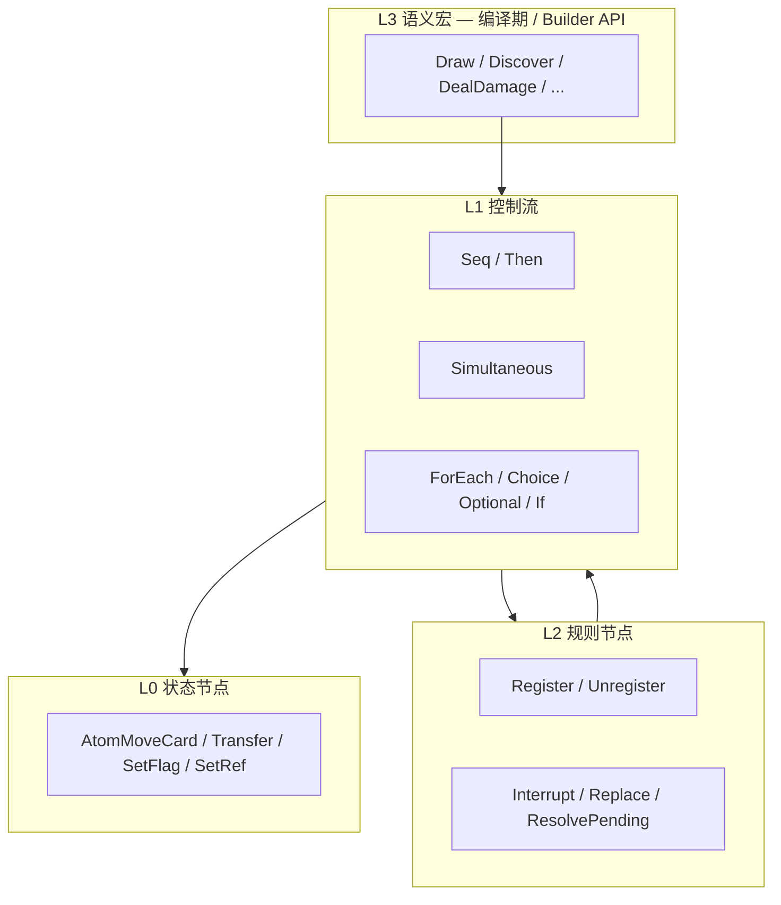

# 07b — 效果组合 Composition 规格

> **依赖**：[07-effect-primitives.md](07-effect-primitives.md), [06-registration-buff-model.md](06-registration-buff-model.md)  
> **被依赖**：[06-ability-initiation.md](06-ability-initiation.md)（dry-run）、LISTENER Buff  
> **状态**：v0.9.5 · 2026-09-21 — 卡面叶子 nest seq.effect.*

---

## 1. 目标

定义 **效果组合（Composition）**：**卡牌正文** 的译法——「这段效果怎么做」的可执行树。叶子是 **效果**（**状态原语** L0 Atom + **Register**）；枝干是顺序 / 同时 / 条件 / 选择。运行时在某条命名流程的 RESOLVE 砖、打出 Initiation resolve、或 LISTENER 开火时 `execute`。

**英文（代码）**：`Composition` / `CompositionNode` / `CompositionExecutor` / `CompositionDryRunner`  
**中文（文档）**：效果组合 / 组合节点

**揭示（Reveal）卡牌** 经 L0 **`AtomRevealCard`** 写入 Domain，**参与** §4 dry-run **CREATED** — 见 [07-effect-primitives §5.3](07-effect-primitives.md)、[01 §3.6](01-game-state-zones.md)。

### 1.1 它是什么、不是什么

| | |
|---|---|
| **是** | **卡牌正文** 的编译产物：控制流 +「去装载哪几条命名流程」。Then / If / Choice 在树上；放毁灭、造成恐惧、创建 Buff 是 **nest 已铸造的 seq.***。 |
| **不是** | 时点信封（那是 seq 的 Would/When/After）；不是现场局面快照；不含玩家已做的选择。 |
| **谁编排时机** | **命名流程** `seq.*` = 规则书手续（抽牌、检定、显现入口…）。能力 **hook** 订 `(seq, slot)`；**effect** 仍是本棵树。**打出**走独立的 `PLAY_CARD`。 |
| **调用规则手续** | 卡面写到「抽牌 / 检定 / Cancel」时，树节点 **nest** 已有 `seq.*`。禁止为每张卡登记 `seq.card…`。 |

```text
seq.draw.investigator          ← 命名流程（何时抽、嵌套、时点）
  RESOLVE 某步
    composition.execute(...)   ← 效果组合（这一步具体写什么）

InitiationIntent.PLAY_CARD     ← 打出（不是能力）
  七步手续过后
    composition.execute(...)   ← 事件/支援打出后的效果体

AbilitySpec.effect             ← 卡牌正文 = 一棵 Composition（不是 seq.card）
```

### 1.2 与命名流程对照

两边最后都落到 **状态原语 + Register**（那才是效果）。差别在 **管什么**，不是两套互不相干的写入引擎。

| | **命名流程（named flow / `seq.*`）** | **效果组合（Composition）** |
|---|---|---|
| **一句话** | 规则书里有名字、可复用、带时点的 **手续** | 卡牌正文「这段怎么做」的 **可执行树** |
| **译什么** | Grimoire 章节、框架步、行动内核、检定、入手/显现入口、共享 Cancel/Instead | 能力体、显现体、打出后效果体、lasting 写入 |
| **身份** | Catalog 里一条 `flow_id`（全游戏共用） | 某张卡某个 ability 编译出的树（按卡一份） |
| **禁止** | 为每张卡登记 `seq.card…`；单卡 `*Policy` | 自己开放 Would/When/After；取代 Catalog 调度 |
| **运行时** | 压进 `ResolutionSequenceStack` | `CompositionExecutor.execute`；不单独占一层堆栈 |
| **结构** | 有序 **砖块**（Brick：EFFECT / REVEAL / SUBSEQUENCE / FRAMEWORK） | 节点树：Atom、Register、Seq/Then、Simultaneous、If、Choice、Interrupt、Replace |
| **时点** | 有 WOULD / WHEN / AFTER（整段手续的槽） | **无**自己的时点槽。Then 是树内顺序，不是 After |
| **谁启动** | 框架步、行动、另一条 seq nest、卡面树 nest 已有 seq | 某条 seq 的 EFFECT 砖、打出 Initiation resolve、LISTENER 开火 |
| **嵌套** | `catalog.nest` 另一条 seq = 新 triggering condition、LIFO 子手续 | 树内顺序/同时/分支；**调用规则手续**时才 nest seq |
| **内联** | 同 seq 内连续砖、不触发新时点 → 不 nest | Then / 普通 Seq：后段读前段 CREATED，不另开反应窗 |
| **dry-run** | 一般不拿整条手续做 L7 | L7 在这棵树上问：有没有至少一项 CREATED |
| **能力上的位置** | **hook**：订 `(sequence_id, slot)` + tier | **effect**：`AbilitySpec.effect` |
| **打出** | 打出不是 seq 卡面。Play action 可 nest 内核 seq（进场等） | 打出后的效果体是树；种类仍是 `PLAY_CARD` |
| **显现** | 入口手续：`seq.encounter.revelation` / `seq.enter_hand` | 该显现段落的树，在入口 RESOLVE 里 execute |
| **Cancel / Instead** | 共享手续 `seq.interrupt.*` / `seq.replace.instead` | 卡面树里的 Interrupt / Replace 节点去 nest 上述手续 |
| **provenance** | `flow_id` = 当前在哪条手续里 | `definition_id` + `ability_id`；跑的时候仍带着所在 `flow_id` |

**怎么接在一起**

```text
规则手续（seq）打开时点、走砖块
        │
        ├─ 砖块自己写 L0 / Register（抽牌 D2 揭示等）
        ├─ 砖块 nest 另一条 seq（显现入口、涌动再抽）
        └─ 砖块 composition.execute ← 卡面树
                 │
                 ├─ Atom / Register / Then / If / Choice
                 └─ 正文点名「抽牌 / 检定 / Cancel」→ 再 nest 已有 seq
                          │
                          └─ 子手续完整跑完（含自己的 When/After）再回到树

打出 PLAY_CARD：七步手续（付费、AOO…）≠ seq 卡面
        └─ resolve 步 composition.execute ← 同一类卡面树
```

**锚例**

| 来源 | 命名流程 | 效果组合 |
|---|---|---|
| 神话阶段抽遭遇 | `seq.draw.encounter` 整段 G0–G4 | 无「这张阶段」专用树 |
| 12160 显现正文 | 跑在 `seq.encounter.revelation` 里 | `Seq(nest 放毁灭 → if 没 CREATED 则 nest 创建涌动)` |
| 卡面「gains surge」 | nest `seq.effect.register`（KEYWORD/LISTENER 模板） | 创建；**开火**仍是 `seq.keyword.surge` |
| Forced – When you draw, take 1 horror | hook = `(seq.draw.investigator, WHEN)` | 树 = 造成 1 恐惧 |
| 事件「Draw 1 card. Then take 1 horror.」 | 树节点 nest `seq.draw.investigator` | `Seq(nest 抽牌, 恐惧)`；Then 不另开窗 |
| Ward 取消显现 | hook 订显现相关槽 | Interrupt 节点 nest `seq.interrupt.cancel` |

对照实现清单见 [17-seq-runtime](17-seq-runtime.md)；砖块 vs 原子见 [15 §4.0.1](15-timing-entry-catalog.md)。

#### 1.2.1 运行形态 vs 中间语言（已裁决 2026-09-21）

**命名流程是最后的运行形态**：只有 `seq.*` 压进结算堆栈，带 WOULD / WHEN / AFTER。游戏里「正在结算哪一条手续」以栈顶帧为准。

**效果组合是中间语言**，给 **当前栈帧的 RESOLVE** 用，不是再包一层外壳，也不是整棵树编译没了只剩 seq：

| 树节点做什么 | 运行时 |
|---|---|
| Then / If / Choice、放标记、移卡、Register | **留在本帧**解释执行（内联写入；不 push） |
| 正文点名抽牌、检定、Cancel、Instead、生成… | **提供**一条已有 `seq.*` 去 `catalog.nest`（子帧压栈，跑完再回到树） |

```text
栈：  [seq.draw.encounter]          ← 运行形态（有时点）
         RESOLVE 砖
           解释 Composition 树      ← 中间语言（无自己的时点）
             Atom / Then / If        本帧写完
             nest seq.skill_test.*   再压一帧手续
```

**不是**：卡面 → 全部降成 `seq.card…` 再跑。  
**也不是**：效果组合自己占一层堆栈。  
**缺口**：Initiation 现仍 `composition.execute` 绕栈（17 I2）。按本条，resolve 应落在 **已经在栈上的手续**（打出/窗口/父 seq）里解释树，而不是真空执行，也不为每张卡新开 seq。

### 1.3 静态信息：编译、装载、解释（已裁决 2026-09-21）

效果组合 **不该真空跑**。它是 **待解释的静态树**（数据），由游戏框架 **编译并装载** 到命名流程栈上，再由 **解释器** 在当前帧 RESOLVE 里走树。

```text
卡面自然语言
    │  编译（初步翻译 / 规范化）
    ▼
静态效果组合（JSON / AbilitySpec.effect / CompositionNode 树）
    │  装载：hook 订已有 seq 槽；树挂到该帧 RESOLVE
    ▼
结算堆栈上的命名流程
    │  解释器（CompositionExecutor）
    ▼
本帧 Atom / Register / Then / If / Choice
  或 nest 已有 seq.*（子帧压栈，跑完回到树）
```

| 阶段 | 做什么 | 现在落点 |
|---|---|---|
| **编译** | 自然语言 → 规范化静态树（hook + 情景 + 费用 + effect） | `tools/arkhamdb_abilities.py` → `compiled_abilities`；GDScript `ArkhamDbAbilityCompiler.build_composition` |
| **装载** | 把树挂到已有手续：订阅 `(seq, slot)`，或打出 Initiation 的 resolve 砖 | `register_triggered` / `register_revelation`；**禁止**为每张卡 `seq.card…` |
| **解释** | 栈帧内走树；dry-run 也走同一套节点 | `CompositionExecutor` / `CompositionDryRunner` |

**CardScript / AbilityTemplate** 都是编译侧的作者工具，产物必须是 **同一类静态树**。`on_custom_effect` 在脚本里直接改局面 **不是** 目标运行时（对齐 [12](12-card-script-api.md)）。

#### 1.3.1 工作流 A — 丰富框架解释器

解释器只认识静态节点，不读自然语言。要补的是「这棵树在栈上怎么走完」：

| 方向 | 说明 |
|---|---|
| **禁止裸 execute** | 收 17 I2：Initiation / LISTENER 开火时，先确保有父 seq 帧，再 `execute` |
| **节点完备** | 已有 Seq / Atom / Register / If / Choice / Repeat / ForEach。补 Simultaneous、Interrupt、Replace 为一等节点（或稳定 nest `seq.interrupt.*` / `seq.replace.instead`） |
| **nest 是节点** | 凡可解释效果都指向 Catalog 里的 `flow_id`（含纸面无名的 `seq.effect.*`）；不要靠 atom 名字符串当效果落地 |
| **铸造无名效果** | 见 §1.3.3：种类级 `seq.effect.*`，参数化 amount/目标；禁止 `seq.card…` |
| **dry-run 同源** | L7 与真实解释同一套 kind；Then 真实结算顺序、dry-run 仍 OR |
| **装载 API** | 框架：`load(spec) → bind hook + 把树交给该 seq 的 EFFECT 砖` |

#### 1.3.2 工作流 B — 自然语言初步翻译 / 规范化

编译器把卡面切成已有字段，**不**在运行时 `match effect_text`：

| 卡面段落 | 静态字段 |
|---|---|
| When / After / Revelation / 打出窗口 | `hook`：`(sequence_id, slot)` + tier；打出另标 `play_form` |
| If / While 情景 | `Condition` + `if_kind` / `evaluate` |
| 费用 | `costs[]` |
| Then / 同时 / 选择 / 造成伤害 / 注册 | `effect` 树：控制流 + `nest: seq.effect.*`（或已有抽牌/检定 seq） |
| 点名抽牌、检定、Cancel | effect 节点 `nest: seq.*`，不新开卡面 seq |

现状：遭遇包约 90 段能力、14 段编出树（`core_2026_encounter.json` 摘要）；其余仍是 segment。工作流 B 的目标是扩大 **规范化覆盖**（复用已有 template / condition），不是另写运行时脚本。

**编译产物形态**（与现 JSON 对齐，锚例 12160）：

```json
{
  "register_as": "revelation",
  "hook": { "sequence_id": "seq.encounter.revelation", "slot": "RESOLVE" },
  "effect": {
    "template": "seq",
    "steps": [
      { "template": "place_doom_nearest_enemy_without_doom" },
      {
        "template": "if_else",
        "if_kind": "condition",
        "evaluate": "after_step",
        "condition": "previous_step_not_created",
        "then": { "template": "grant_surge" }
      }
    ]
  }
}
```

装载后这棵树只在 `seq.encounter.revelation` 的 RESOLVE 里被解释。

#### 1.3.3 Catalog 必须覆盖一切可解释效果（纸面可以无名）

难点：命名流程是 **解释器唯一能「当真效果」去跑的单位**。纸面没有章节名，不代表引擎可以不命名。

「Take 1 horror」「Place 1 doom」在 Grimoire 里往往只是效果句，没有「Take Horror Sequence」。但它们 **能被解释**，而且会被「after you take horror」这类 hook 听到。因此 Catalog 里必须有对应的 `seq.*`，由引擎 **发明稳定 id**。

| 纸面 | 引擎命名 | 不是 |
|---|---|---|
| Draw / Skill Test / Fight action | 沿用规则书手续名：`seq.draw.*`、`seq.skill_test.*`、`seq.action.fight` | — |
| 无名但可独立解释的效果句 | **铸造** `seq.effect.*`（或已有 `seq.gain_resource`） | 真空跑 Atom |
| **创建 / 卸掉 Buff**（Register / Unregister） | **铸造** `seq.effect.register` / `seq.effect.unregister`（参数：template、lifetime、buff 种类） | 真空跑 `CompositionNode.REGISTER` |
| 某张卡独有的整段故事 | 仍是 Composition 树，去 **组合** 上表条目 | `seq.card.12160` |
| Then / If / Choice | 树的控制流，**不是** 效果，不铸造 seq | 把 Then 做成 `seq.then` |

已有先例：`seq.effect.discover_clue`、`seq.gain_resource` — 纸面未必叫这个名字，引擎已经当命名流程压栈。

**铸造判据（mint）**

给一个 **效果种类** 登记 `seq.*`，当它同时满足：

1. 解释器要把它当成一次可 CREATED 的效果跑完；
2. 可能被 Would / When / After 订阅，或会在多张卡/多条手续里复用。

用 **参数** 区分次数与目标（`amount`、`bearer`），不要为「造成 1 恐惧」和「造成 2 恐惧」开两条 seq。Register 用参数区分 `MODIFIER` / `RESTRICTION` / `LISTENER` / KEYWORD 标记，不要为每个关键词各开一条 `seq.effect.register_surge`（消费涌动仍是已有的 `seq.keyword.surge`，那是 **开火**，不是创建）。

**不铸造**

- 某张卡的段落（12160 整段仍是树：nest 放毁灭 + If + nest 涌动）。
- 控制流节点本身。
- seq 内部的 L0 碎步（`seq.effect.take_horror` 的 handler 里 `AdjustMarker` 仍内联，不升格成 `seq.atom.adjust`）。
- 管线里 **为父手续服务** 的 Register 砖（遭遇抽牌 G2 险境、ENTER_PLAY 挂 Hunter）：算该父 `seq.*` 已覆盖；**不要**另开 `PERIL_CHECK`。只有卡面「获得持续/延时/涌动」这种 **当效果写出来的创建** 才 nest `seq.effect.register`。

```text
可解释效果  ⊂  Catalog 里的 seq.*
              ├─ 纸面有名：seq.draw / seq.skill_test / seq.action…
              ├─ 状态原语类无名效果：seq.effect.take_horror / place_doom / heal / …
              └─ Buff 创建 / 注销：seq.effect.register / unregister
                             （handler 内才写 RegistrationStore；CREATED = 插入成功）

Composition 树  =  控制流 +「去装载哪几条 seq、带什么参数」
解释器跑效果   =  nest/run 那条 seq（本帧只解释树，不私自 Atom 或 Register）
```

工作流 A 补 Catalog + 让解释器 **只通过 seq 落地效果**（含创建 Buff）。  
工作流 B 把「gains surge / until end of turn / cannot…」规范到 `seq.effect.register` + `RegistrationTemplate`，不是编成裸 Register 节点当运行时。

框架 1.3 `seq.mythos.place_doom` 与卡面「在最近敌人上放 1 毁灭」是 **两种** 手续（议程 vs 效果），不要合成一条。

### 1.4 树的力度、树上带什么、动态数据放哪（已裁决 2026-09-21）

时点信封包的是 **命名流程栈帧**，一层 nest 一层。所以 seq 必须细到「能被 When/After 单独听到」的效果种类。效果组合 **不是** 另一套更细的信封：它只决定 **下一层压哪几条 seq、用什么静态规格、控制流怎么走**。

#### 力度：两头都不要

| 太粗 | 正好 | 太细 |
|---|---|---|
| 整张卡一段 `seq.card…` | 一个叶子 = **一条已铸造 seq**（`nest flow_id` + 参数规格） | 每个 L0 Atom 当叶子，又当信封 |
| 没有 Then / If，整段当一步 | 控制流细到 Then、If、Choice、Simultaneous | 把 Then 做成 `seq.then` 去占时点 |

```text
seq.encounter.revelation          ← 信封：显现手续（有 When/After）
  解释静态树
    Seq
      nest seq.effect.place_doom  ← 信封：放毁灭（可被 after place doom 听到）
      If after_step 未 CREATED
        nest seq.effect.register  ← 信封：创建涌动 Buff
```

叶子里的 L0 / `RegistrationStore.insert` 只出现在 **被 nest 的那条 seq 的 handler** 里，不出现在卡面树当「效果本身」。

#### 树上只放静态规格（编译期 + 装载期）

| 带什么 | 例子 | 何时填 |
|---|---|---|
| **控制流** | `Seq` / Then、`Simultaneous`、`If`（`if_kind`、`evaluate`）、`Choice`（must、option 子树） | 编译 |
| **要 nest 的 `flow_id`** | `seq.effect.take_horror`、`seq.draw.investigator`、`seq.effect.register` | 编译 |
| **字面参数** | `amount: 1`、`skill: intellect`、`difficulty: 3`、`keyword: surge` | 编译（卡面写死的数） |
| **寻址规格** | `TargetSpec`（nearest enemy without doom）、`Condition` id、`RegistrationTemplate` 形状 | 编译（还不是具体 entity id） |
| **provenance** | `definition_id`、`ability_id` | 编译 |
| **装载绑定** | `AbilityBindContext`：`controller_id`、`card_id`（实例）、所挂父 `flow_id` | **装载 / 实例化**，不是编译 |

**禁止写进树**：当前线索数、谁在哪个地点、这次选了哪名敌人、玩家点了哪一支。那些是解释当下的查询或输入。

#### 动态场面：解释时查，不拷进树

四套东西，不要混：

| | **是什么** | **寿命** | **典型读法** |
|---|---|---|---|
| **`GameStateStore`** | 现态 | 对局 | `Condition` / `TargetSpec` |
| **`RegistrationStore`** | 已在场 Buff | 随 Lifetime | Cannot、修正值收集 |
| **`RulesMemory`** | **本趟**手续的工作便笺 | 随栈帧 / 本条 seq 跑完 | Then、after_step If、pending 抽出牌 |
| **`ApplicationContext`** | **这一次查询**的场合快照 | 一次 TimingOffer / modifier compute 用完即弃 | `Condition.matches`、MODIFIER |
| **`EventRecord`（权威）+ `StatProjection`（读模型）** | **历史**：本回合第几次行动、本轮 Limit | 整局流水；投影随 Registration 热/冷 | Eligibility L3/L5 历史谓词 |

`ApplicationContext.referents` 只是 **从 RulesMemory 拷来的切片**，给这次评 Buff 用，**不是**历史库。历史谓词 **禁止** 从 Domain 压扁字段推（如 `budget − actions_remaining`），也 **禁止** 塞进 RulesMemory 当「本回合行动史」。见 [06c](06c-stat-projections.md)。

#### RulesMemory vs ApplicationContext

| | **RulesMemory** | **ApplicationContext** |
|---|---|---|
| **角色** | 可变的 **工作记忆**（scratch） | 只读的 **场合信封**（这次问 Buff/条件时的拼凑维度） |
| **谁写** | seq handler / 解释器 / Gate 选完目标 | 几乎不写业务；`from_sequence(stack 顶 trigger, phase)` **生成** |
| **装什么** | 步间指称：`draw_pending`、`last_step_created`、遭遇帧栈、本 seq 已被 Cancel | `timing`、`framework_step`、`tags`、`controller_id`、`trigger`、`payload`、从 Memory **拷** 的 `referents` |
| **范围** | 嵌套栈这一趟（抽这几张、显现这一张） | 当前 When/After/Resolve **这一窗** 评一次 Eligibility / MODIFIER |
| **问「刚选中哪个敌人」** | 读这里 | 若需要，快照里带一份拷贝 |
| **问「这是 Upkeep 4.4 的获得资源吗」** | 不负责 | `framework_step` + `tags` |
| **问「你本回合第几次行动」** | **不负责** | **不负责**（走 EventRecord → StatProjection） |

代码：`RulesMemory` 是 `GameContext.memory` 长住对象；`ApplicationContext.from_sequence` 每次开窗 new 一份。06 §12 旧注把 referents 写成「历史条件」是误导，历史不在这两处。

#### 历史记录（没有漏组件，§1.4 原先写太短）

| 层 | 职责 |
|---|---|
| **`EventRecordLog`** | append-only 权威流水（initiation 步、composition_step、行动花费…）。**写** 在效果落地 / Initiation / 交互时 |
| **`StatProjectionStore`** | 按需从流水 **fold** 出「本回合 action 次数」等；随 Buff Registration attach/detach |
| **`GameLog`** | 调试/叙述轨迹，不是 Eligibility 数据源 |
| **`RulesMemory.phase_trace`** | 仅本趟栈的 WHEN/RESOLVE/AFTER 痕迹，给测试用，**不是** 对局史 |

卡面「After your third action this turn」：编译成 `StatQuery`，COLLECT 时读投影，**不**把 action 列表写进 Composition 树或 Memory。

解释器 nest 子 seq 时：把 **字面参数 + 刚解析出的 id（来自 Domain 或 Memory）** 放进这次 `params`，子信封用完即弃，不回写卡面树。历史次数仍只经投影读流水。

#### 用户输入：Gate，不进树、不进 Domain

玩家交互（Player Interaction）只回答「在客观合法的前提下选哪支 / 选谁 / 是否发动」。入口只有 **`PlayerInteractionGate`**（[16](16-player-interaction.md)）。

| | 静态树 | 运行时 |
|---|---|---|
| 二选一 / must choose | `Choice` 节点 + 各支子树 | `ask(ChoiceRequest)` → 选中支再解释 |
| 目标「最近的敌人」并列 | `TargetSpec` + 等距规则 | `PICK_TARGET`；结果写入 `RulesMemory` 再交给 nest params |
| 要不要用这条反应 | **不在 effect 树里** | hook 窗口的 `USE_ABILITY` |
| 费用弃哪张、X 取多少 | **不在 effect 树里**（CostPipeline） | 费用交互；付完再解释 effect |

**禁止**：把所选目标写回 `compiled_abilities` JSON；在 `StateMutator` 里 `if ui_clicked`。

装载绑定（这张实例的控制者）≠ 用户输入。前者随卡进场填进 `AbilityBindContext`；后者每次解释向 Gate 再问。

---

## 2. 游戏结算的两类「直接影响」（= 效果）

几乎 **全部卡面效果 resolve** 对局面/规则的 **可 CREATED 写入** 只做两件事之一：

| 类型 | 改什么 | 组合节点 | 是否效果 |
|---|---|---|---|
| **状态变更** | `GameStateStore` | L0 **Atom**（**状态原语** 三类；含 **Reveal**） | **是** |
| **规则变更** | `RegistrationStore`（Buff） | L2 **Register** / **Unregister** | **是** |

Grimoire **Reveal 卡牌** = L0 **`reveal_to_*`**（③ 揭示状态），**不是** Register 之外的第三类机制；命名流程 D2/E2 的 reveal 步 **是效果施加**。

Cancel / Replacement、Draw、DealDamage 等 **不是** 第四类 CREATED 机制：前者是 L2 组合节点；后者是 **命名流程 / L3 宏** 展开。

---

## 3. 组合节点分层



### 3.1 Runtime 节点 kind（v1）

| 层 | kind | 说明 |
|---|---|---|
| L0 | `Atom` | [07-effect-primitives §5](07-effect-primitives.md) **三类状态原语** |
| L2 | `Register` | 插入 `Registration` |
| L2 | `Unregister` | 移除 Registration |
| L2 | `Interrupt` | 统一 Cancel / Ignore（nest `seq.interrupt.*` 或 `CompositionNode.interrupt_*`） |
| L2 | `Replace` | 统一 Instead（nest `seq.replace.instead` 或 `CompositionNode.replace_instead`） |
| L2 | `ResolvePending` | 窗口结束后 resolve pending |
| L1 | `Seq` | 顺序。Grimoire **Then** = 同一棵树上的顺序 Seq（§3.1.1） |
| L1 | `Simultaneous` | 同时组；组 commit 后才 flush after |
| L1 | `ForEach` | 枚举目标 |
| L1 | `Choice` / `Optional` | 玩家选择 — **`PlayerInteractionGate`**（[16](16-player-interaction.md)） |
| L1 | `If` | 情景条件分支 · `CompositionNodeKind.IF`（§3.3） |

**L3 宏不进入 serialized tree**；`CompositionBuilder` 在编译期或调用时展开。

#### 3.1.1 Then = 内联 Seq（已裁决 2026-09-21）

卡面 **Then** 不是时点，也不是 nest 另一条命名流程。

| | |
|---|---|
| **是** | 同一棵 Composition 里的顺序 `Seq`。后一步读前一步已经 CREATED 的局面；前一步未 CREATED 则后一步不进（Grimoire Then）。 |
| **不是** | Would / When / After 槽；Then 前后不另开反应窗。能否插入反应，沿用已有窗口规则（14 / 15），不因 Then 另开一条。 |
| **与 After 的关系** | 前段间接产生的 **after** 等 **整段 Seq 跑完** 再 flush；后段优先于该 after（Grimoire Then 优先）。这是冲洗顺序，不是在 Then 中间插入反应。 |

### 3.2 RegisterNode

```gdscript
class RegisterNode extends CompositionNode:
    var template: RegistrationTemplate   # lifetime + scope + buffs[]
```

创建 **持续 / 延时 / 进场能力** 均为此节点；差别在 `LifetimeSpec`（见 [06-registration-buff-model §6](06-registration-buff-model.md)）。

### 3.3 卡面 **If** 消歧（timing · condition · both · 已裁决 2026-07-07）

英文 **If** 在卡面上有歧义：可能是 **时点**、**情景条件（L3）**，或 **二者兼有**。编译管线 **必须** 标注 `if_kind`，**禁止** 把 Revelation/Forced 已提供的 timing 再译成 LISTENER。

| `if_kind` | 含义 | 引擎落点 | 典型例子 |
|---|---|---|---|
| **`timing`** | 何时能/必须触发 | TimingCatalog · L0 订阅 · COLLECT | Forced – **When** you draw…；If **during this test**…（无现态谓词） |
| **`condition`** | resolve **当下** 局面是否满足 | Composition **`IF`** + `Condition.matches_domain` | **12126** *If you have no clues*（Revelation 已定 G3 timing） |
| **`both`** | 窗口内再判现态 | timing 窗口 + L3 predicate | *If you reveal a `[skull]` during this test* |

**Revelation / Forced 前缀已给出 timing entry** 时，正文 leading **If** 默认按 **condition** 解析，除非命中 timing 短语（`during this test`、`when you draw` 等）。`Otherwise` = **互斥效果支**，译 `CompositionNode.if_else(then, else)`，**不是**新 timing。

#### 12126 Forbidden Secrets（锚例）

```text
<b>Revelation</b> – If you have no clues, … gains surge. Otherwise, test [intellect] (3)…

timing  : ENCOUNTER_CARD_DRAWN → G3（Revelation Forced，非 If 提供）
if_kind : condition
compile :
  if_else(
    Condition.investigator_has_no_clues(controller),
    then: grant_surge,
    else: nest seq.skill_test.intellect(3)
          + st7_fail_by: Choice(must) × fail_by   # 见下
  )
```

**Fail-by 衍生（FAQ · OQ-05-03）** — 见 04 §3.7 **ST.7 内联 Composition** 总表；12126 仅用 `on_fail_by_each` 槽。

| | |
|---|---|
| **不是** | ST.6 嵌套后果；nest pop 后父 Composition Seq |
| **是** | **ST.7** 内 `SkillTestSt7Plan` → 内联 Composition（Choice 仍非 timing nest） |

```text
else 支 compile:
  skill_test(intellect, 3):
    st7:
      on_fail_by_each: Choice(must): clue | horror
runtime: nest seq.skill_test.* + SkillTestSt7Composition.register_plan @ ST.7
```

Python：`tools/arkhamdb_abilities.py` · `compile_revelation_if_else()` / `compile_forbidden_secrets_fail_by()`。

GDScript：`CompositionNodeKind.IF` · `nest_skill_test(..., st7_fail_by)` · `SkillTestSt7Composition`。

**Dry-run**：`IF` 在 fork 上 **求值 condition**，只 simulate **选中支**（与 `Choice` 的 OR 任一支不同）。

#### 「你的线索」（clues · 已裁决 2026-07-07）

一般情况下 **your clues / clues you have** = 调查员**卡牌上**的 clue 指示物（Domain · `investigator.clues_on_card` / `CLUES_ON_INVESTIGATOR`），**不**含地点上的 clue pool，除非卡面 explicitly 指 location。`Condition.investigator_has_no_clues` 即 `clues_on_card == 0`。

#### If 求值时机：`at_entry` vs `after_step`

| 模式 | 含义 | 锚卡 |
|---|---|---|
| **`at_entry`** | G3 显现 resolve **开头**判条件 | 12126 *If you have no clues* |
| **`after_step`** | **上一效果步完成后**再判（含「本效果是否 CREATED」） | 12160 *If no doom was placed by this effect* |

12160：**未执行** = 无合法目标 **或** 被 Cannot/Replacement 等拦截导致 place-doom 步 **未 CREATED** → 视为 no doom placed → gains surge。编译：`Seq(place_doom_nearest_enemy_without_doom → if_else(previous_step_not_created, grant_surge))`；等距 tie-break 由 **当前交互玩家**（drawer）`PICK_TARGET`。

#### 能力多要素拆分（已裁决 2026-07-07）

卡面能力可同时具备 **时点 · 条件 · 费用 · 效果**；编译 **能拆就拆**，勿合并为单一「If」或单一 template：

```text
Forced – When [timing], if [condition], [cost]: [effect]
  → LISTENER timing（When）
  → Condition L3（if）
  → CostPipeline L6（cost）
  → Composition（effect）
```

Revelation 无 When 前缀时，timing 由 **Revelation @ G3** 提供；正文 If 默认 **condition**（§3.3 表）。

#### 「Must choose」与 Choice dry-run（已裁决 2026-07-07 · FAQ）

卡面 **You must either (choose one)** / **must choose**（12124）或等效 **must** 语义（12126 fail-by 支：印刷漏写 must，按 must 解读）：

1. **resolve 前**用 dry-run **过滤选项**：仅保留 **至少能 CREATED 一项效果** 的分支。
2. 玩家 **必须** 选一项可执行选项；若仅一支可 CREATED → **自动**该支（headless 默认策略）。
3. Choice 合法性 dry-run（发起前）：仍 **OR 任一支 CREATED** 即可；**resolve 时**不得选 FIZZLE 支。

详 [16 §7.2.1](16-player-interaction.md#721-must-choose--可执行选项--已裁决)。

#### 12124 Cosmic Evils · 编译锚（partial）

```text
Choice(must, filter=dry_run_executable):
  A: place_doom(current_agenda) → nest 密谋推进框架（放置后 doom 阈值检测 · 可 advance）
  B: direct_damage(1) + direct_horror(1) + grant_surge
```

#### 检定 ST.7 内联效果（已裁决 2026-07-08）

凡 *If you succeed/fail*、*If this test is successful/failed*、*for each fail by*、committed *If successful…* — **均属 ST.7 内联 Composition**（`SkillTestSt7Plan`），**不是**显现/Revelation 父 Seq 的 post-nest 步。检定本身仍 **nest** `seq.skill_test.*`（15 §17.5）。

编译 JSON：

```json
{
  "template": "skill_test",
  "skill": "intellect",
  "difficulty": 3,
  "st7": {
    "on_success": { "template": "..." },
    "on_fail": { "template": "..." },
    "on_fail_by_each": { "template": "choice_must", "options": [ ... ] }
  }
}
```

#### 12126 fail-by · must 语义

*For each point you fail by, you must either place 1 clue… or take 1 horror* — 印刷未写 must 视为 **笔误**；引擎按 **must choose 可执行项** 处理（无 clue 可放 → 必须 horror）。**执行槽位 = ST.7**（04 §3.7 · OQ-05-03），非显现 Seq 的 post-nest 内联步。

#### 12160 Raising Suspicions · 编译锚（partial）

```text
timing  : Revelation @ G3
compile :
  Seq(
    place_doom_nearest_enemy_without_doom(drawer),
    if_else(previous_step_not_created, grant_surge)   # evaluate: after_step
  )
referent: CompositionExecutor.last_step_created + EventRecord COMPOSITION_STEP（07 §5）；非 Domain doom
tie     : nearest 等距 → 当前交互玩家 PICK_TARGET
```

## 4. 合法性 Dry-run（CompositionDryRunner）

> 完整 Initiation 流程见 [06 §7.2](06-ability-initiation.md)。Eligibility L7 终端 dry_run；COLLECT 不批量 dry_run。

### 4.1 原则（已裁决）

**有效性检测只关注「效果是否被创建」这一直接影响。**

- **Register**：`RegistrationStore` 中 **成功插入一条 Registration** → 该节点 **CREATED**（**Buff 写入是效果**）
- **Atom**（含 **`reveal_to_*`**、SetFlag/SetRef）：`StateMutator` 在 fork 上 **执行成功** → **CREATED**（**状态原语**）
- **Interrupt / Replace / ResolvePending**：pending 存在且操作成功 → **CREATED**

**Presentation** 只 **读** Domain 揭示状态渲染 UI；**不** 单独维护「谁看到了什么」。

**创建之后** Buff 是否退化、Listener 将来能否触发、MODIFIER 是否用到、牌堆是否会在未来变空 — **一律不查**。

### 4.2 发起合法条件

```text
initiation 合法  ⟺  play restrictions 过
                AND  cost 可付
                AND  simulate(composition).has_any_created == true
```

```gdscript
enum DryRunOutcome { CREATED, FIZZLE }

class CompositionDryRunner:
    func simulate(node: CompositionNode, sim: GameSimulator) -> DryRunResult:
        match node.kind:
            Atom:
                return CREATED if sim.apply_atom(node) else FIZZLE
            Register:
                return CREATED if sim.register(node.template) else FIZZLE
            Seq:
                var any := false
                for c in node.children:
                    any = any or simulate(c, sim).has_any_created
                return DryRunResult.new(has_any_created = any)
            Choice:
                return DryRunResult.new(
                    has_any_created = any(simulate(opt, sim).has_any_created for opt in node.options)
                )
            ...
```

### 4.3 Fork 范围

`GameSimulator.fork()` 必须包含：

- `GameStateStore`
- **`RegistrationStore`**
- （若测 Cancel）`PendingResolution` 队列

### 4.4 Dry-run vs 真实结算

| | 合法性 dry-run | 真实 resolve |
|---|---|---|
| **Seq / Then** | 子节点 **OR**：任一段 CREATED 即可发起 | **顺序**执行；Then 前段须 resolve 才进后段（Grimoire Then） |
| **Register** | 插入即 CREATED | 同左 |
| **Choice** | 任可选分支 CREATED | 玩家选一支执行 |
| **If** | 按 fork 上 condition 选一支 CREATED | 求值 condition 后执行 then/else |

### 4.5 示例

| 卡面 | dry-run |
|---|---|
| Until end of your turn, after you fight, draw 1 | **Register CREATED** → 合法（即使本回合不 fight） |
| Draw 1（仅一段，牌堆空） | Atom FIZZLE → 非法 |
| Draw 1 + Register（上例） | Register CREATED → **合法** |
| Heal 2（无受伤目标，且无 Register） | Atom FIZZLE → 非法 |

---

## 5. CompositionExecutor

```gdscript
class CompositionExecutor:
    func execute(node: CompositionNode, ctx: ApplicationContext) -> void
```

- L0 → `StateMutator`
- Register → `RegistrationStore.register`
- Listener Buff 内嵌的 composition 由 `TimingBus` 回调同一 Executor
- 每步写 `EventRecord`（`composition_step` / `atom` / `register`）

---

## 6. 与 Initiation 的关系

```
装载     →  hook 订已有 seq；静态树挂上该帧 / 打出 resolve 砖
Initiation Pre  →  RestrictionEvaluator + CompositionDryRunner（走同一棵静态树）
Initiation 4    →  在已压栈的手续里 CompositionExecutor.execute（禁止真空跑 · 17 I2）
Listener 触发   →  同上：父 seq 帧内解释 listener 上的静态树
```

---

## 7. 变更记录

| 日期 | 版本 | 说明 |
|---|---|---|
| 2026-09-21 | v0.9.5 | 解释器：已编译叶子改 nest `seq.effect.*`（take horror/damage、place doom、register、heal…）；ArkhamDB 增编 fail-by 检定 / 失去资源否则攻击 / 来源放毁灭 |
| 2026-09-21 | v0.9.4 | §1.4：RulesMemory=本趟便笺；ApplicationContext=场合快照；历史=EventRecord+StatProjection |
| 2026-09-21 | v0.9.3 | **§1.4** 树力度=控制流+nest 一条 seq；场面在 Domain/Memory；输入在 Gate |
| 2026-09-21 | v0.9.2 | **§1.3.3** Buff 创建/注销也是可解释效果：铸造 `seq.effect.register` / `unregister`；禁止真空 Register |
| 2026-09-21 | v0.9.1 | **§1.3.3** Catalog 覆盖一切可解释效果；纸面无名则铸造 `seq.effect.*`，不为每张卡开 seq |
| 2026-09-21 | v0.9 | **§1.3** 效果组合=静态信息；编译→装载到 seq 栈→解释器；双工作流（解释器 / 文本规范化） |
| 2026-09-21 | v0.8.1 | **§1.2.1** 命名流程=压栈运行形态；效果组合=当前帧 RESOLVE 的中间语言（内联写入 / nest 已有 seq） |
| 2026-09-21 | v0.8 | **§1.2** 命名流程 vs 效果组合对照表（译什么、时点、嵌套、hook/effect） |
| 2026-09-21 | v0.7 | **卡牌正文译 Composition**；不为每张卡建 `seq.card…`；命名流程只译规则手续 |
| 2026-09-21 | v0.6 | **§1.1** Composition = seq/Initiation RESOLVE 步内的可执行树，不是第二调度；**§3.1.1** Then = 内联 Seq，不是时点 |
| 2026-07-07 | v0.5 | clues 域；after_step If；must choose；12124/12126/12160 编译锚；能力多要素拆分 |
| 2026-07-07 | v0.4 | §3.3 卡面 If 消歧；`IF` kind + 12126 if_else 锚例 |
| 2026-06-18 | v0.3 | **AtomRevealCard** 参与 CREATED；撤销 Information 非效果 |
| 2026-06-18 | v0.2 | §2 效果仅 Atom+Register；§4.1 dry-run 原则 |
| 2026-05-25 | v0.1 | 初稿：分层、dry-run 仅关注创建、Register 合法 |
